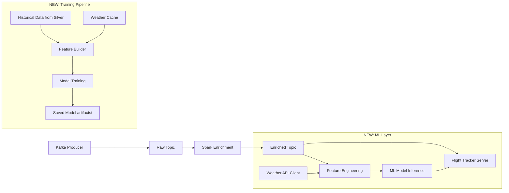

# ML Flight Delay Prediction — Implementation Plan

## Problem & Goal

Build an ML/DL model to predict whether a flight will be **delayed** (and by how much) using:
1. **Internal data** already flowing through the pipeline (callsign, velocity, altitude, vertical_rate, heading, on_ground, origin/dest airports, airline, scheduled departure time)
2. **External weather data** fetched from a free Weather API for origin and destination airports

The predictions should be served in **real-time** alongside the enriched flight data on the existing WebSocket tracker.

---

## User Review Required

> [!IMPORTANT]
> **Choice of approach**: Since you are using **mock data** (not real historical flight delays), we have two options:
> 1. **Synthetic label generation** — Generate realistic delay labels from rules (weather + time of day + airport congestion + airline reliability scores) and train a model on that. Good for demonstrating the full pipeline.
> 2. **Use a real dataset** — Download a public flight delay dataset (e.g., US BTS data or Kaggle Indian flights dataset) to train offline, then apply the model to your streaming data. Better for real ML performance.
>
> **My recommendation**: Option 1 (synthetic + rule-based labels) because it integrates cleanly with your existing Indian aviation mock data pipeline and demonstrates end-to-end ML ops. I'll proceed with this unless you prefer otherwise.

> [!WARNING]
> **Weather API choice**: Free weather APIs have rate limits. I'll use **Open-Meteo** (no API key required, 10,000 requests/day free). If you have a preferred weather API, let me know.

---

## Architecture Overview



---

## Proposed Changes

### Component 1: Weather Data Integration

#### [NEW] [weather_client.py](file:///home/ram/aviation_dataPipeline/src/ml/weather_client.py)

Free weather data fetcher using **Open-Meteo API** (no key required):
- `get_current_weather(lat, lon)` → temperature, wind_speed, wind_direction, precipitation, visibility, cloud_cover, pressure
- `get_weather_for_airports(origin_code, dest_code)` → weather at both endpoints
- In-memory cache with 15-min TTL (matches your `FETCH_INTERVAL`) to avoid redundant API calls
- Async-compatible for batch fetching during training

---

### Component 2: Feature Engineering

#### [NEW] [feature_engineering.py](file:///home/ram/aviation_dataPipeline/src/ml/feature_engineering.py)

Transforms raw flight + weather data into ML features:

| Feature | Source | Type |
|---------|--------|------|
| `hour_of_day` | `ScheduledDepartureTime` | Cyclical (sin/cos) |
| `day_of_week` | System clock | Cyclical (sin/cos) |
| `airline_encoded` | Callsign prefix (IGO/AIC/VTI/SEJ/AKJ) | One-hot |
| `origin_encoded` | Origin airport code | One-hot |
| `dest_encoded` | Destination airport code | One-hot |
| `route_distance_km` | Haversine(origin, dest) | Numeric |
| `origin_wind_speed` | Weather API | Numeric |
| `origin_precipitation` | Weather API | Numeric |
| `origin_visibility` | Weather API | Numeric |
| `origin_cloud_cover` | Weather API | Numeric |
| `dest_wind_speed` | Weather API | Numeric |
| `dest_precipitation` | Weather API | Numeric |
| `dest_visibility` | Weather API | Numeric |
| `is_peak_hour` | Derived (7-10AM, 5-9PM) | Binary |
| `is_metro_route` | DEL/BOM/BLR/HYD | Binary |
| `congestion_score` | Airport flight count in window | Numeric |

---

### Component 3: Model Training Pipeline

#### [NEW] [train_delay_model.py](file:///home/ram/aviation_dataPipeline/src/ml/train_delay_model.py)

- Generates synthetic training data from [routes.csv](file:///home/ram/aviation_dataPipeline/data/routes.csv) + weather cache + delay rules
- Delay rules based on: bad weather (precipitation > threshold), peak hours, high-congestion airports, airline-specific factors
- Trains a **Gradient Boosted Tree** model (XGBoost / LightGBM) — best for tabular data with mixed feature types
- Outputs:
  - Classification: `on_time` / `minor_delay (15-30 min)` / `major_delay (30+ min)`
  - Regression: `predicted_delay_minutes`
- Saves model artifact to `src/ml/models/delay_model.joblib`
- Saves feature encoders/scalers to `src/ml/models/preprocessor.joblib`

#### [NEW] [generate_training_data.py](file:///home/ram/aviation_dataPipeline/src/ml/generate_training_data.py)

- Creates a synthetic labeled dataset by:
  1. Iterating over all routes in [routes.csv](file:///home/ram/aviation_dataPipeline/data/routes.csv)
  2. Simulating multiple days x multiple departure times
  3. Fetching historical weather (Open-Meteo supports past data)
  4. Applying deterministic delay rules with noise
- Output: `src/ml/data/training_data.csv` (~10K–50K samples)

---

### Component 4: Real-Time Inference

#### [NEW] [predictor.py](file:///home/ram/aviation_dataPipeline/src/ml/predictor.py)

- Loads trained model + preprocessor at startup
- `predict_delay(flight_data, weather_data)` → `{delay_probability, delay_category, predicted_minutes}`
- Thread-safe singleton pattern for model loading

#### [MODIFY] [server.py](file:///home/ram/aviation_dataPipeline/src/webapp/server.py)

- Import `predictor` and `weather_client`
- In `FlightAccumulator.update()`, after enrichment:
  1. Fetch weather for origin/dest airports
  2. Build feature vector
  3. Run inference
  4. Attach `delay_prediction` fields to flight state
- New REST endpoint: `GET /api/predictions` — returns delay predictions for all active flights
- WebSocket messages now include `delay_prediction` field

#### [MODIFY] [mock_data_generator.py](file:///home/ram/aviation_dataPipeline/src/speed/mock_data_generator.py)

- Add optional synthetic delay metadata to generated flights (for testing/validation)

---

### Component 5: ML Module Structure

```
src/ml/
├── __init__.py
├── weather_client.py       # Open-Meteo API client with cache
├── feature_engineering.py  # Feature extraction & encoding
├── generate_training_data.py  # Synthetic dataset generator
├── train_delay_model.py    # Model training script
├── predictor.py            # Real-time inference
├── config.py               # ML-specific config (thresholds, paths)
├── models/                 # Saved model artifacts
│   ├── delay_model.joblib
│   └── preprocessor.joblib
└── data/                   # Training data cache
    └── training_data.csv
```

---

### Component 6: Docker Integration

#### [MODIFY] [docker-compose.yml](file:///home/ram/aviation_dataPipeline/docker-compose.yml)

- Add ML dependencies to the `flight-tracker` service environment
- Mount `src/ml/models` volume so models persist across restarts

#### [MODIFY] [Dockerfile](file:///home/ram/aviation_dataPipeline/Dockerfile)

- Add Python ML dependencies: `scikit-learn`, `xgboost`, `joblib`, `requests` (for weather API)

---

## Step-by-Step Execution Order

1. **Create `src/ml/` module** with [__init__.py](file:///home/ram/aviation_dataPipeline/src/__init__.py), [config.py](file:///home/ram/aviation_dataPipeline/src/batch/config.py)
2. **Build `weather_client.py`** — test with a few airport coordinates
3. **Build `feature_engineering.py`** — define feature vector schema
4. **Build `generate_training_data.py`** — create synthetic labeled dataset
5. **Build `train_delay_model.py`** — train and save model
6. **Run training** — generate model artifacts
7. **Build `predictor.py`** — load model, expose `predict_delay()`
8. **Modify [server.py](file:///home/ram/aviation_dataPipeline/src/webapp/server.py)** — integrate predictions into flight accumulator and API
9. **Update Docker configs** — add ML dependencies
10. **End-to-end test** — verify predictions appear in WebSocket/REST output

---

## Verification Plan

### Automated Tests

1. **Unit test the weather client**:
   ```bash
   cd /home/ram/aviation_dataPipeline
   python -m pytest tests/test_weather_client.py -v
   ```
   Tests: API response parsing, cache hits, graceful failure on timeout

2. **Unit test feature engineering**:
   ```bash
   python -m pytest tests/test_feature_engineering.py -v
   ```
   Tests: Feature vector shape, encoding correctness, handling missing values

3. **Model training smoke test**:
   ```bash
   python -c "from src.ml.train_delay_model import train_model; train_model(sample_size=500)"
   ```
   Verifies model trains on small sample without errors

4. **Prediction sanity test**:
   ```bash
   python -c "
   from src.ml.predictor import DelayPredictor
   p = DelayPredictor()
   result = p.predict_delay({
       'callsign': 'IGO102', 'origin_code': 'DEL', 'destination_code': 'BOM',
       'scheduled_departure': '08:30', 'airline_prefix': 'IGO'
   })
   print(result)
   assert 'delay_probability' in result
   assert 'delay_category' in result
   "
   ```

### Manual Verification

1. **Start the pipeline** with `docker-compose up` and observe the flight-tracker at `http://localhost:8050`
2. **Check REST API** at `http://localhost:8050/api/predictions` — verify delay prediction objects exist for active flights
3. **Check WebSocket** — verify flight updates include `delay_prediction` field
4. **Verify weather data** — check logs for successful Open-Meteo API calls
